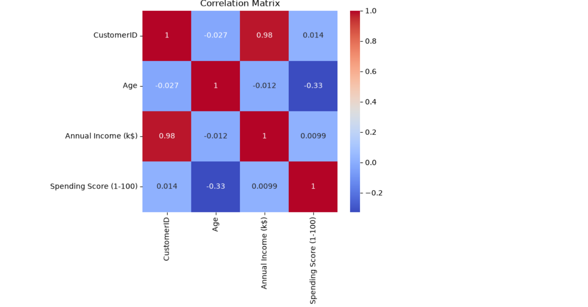
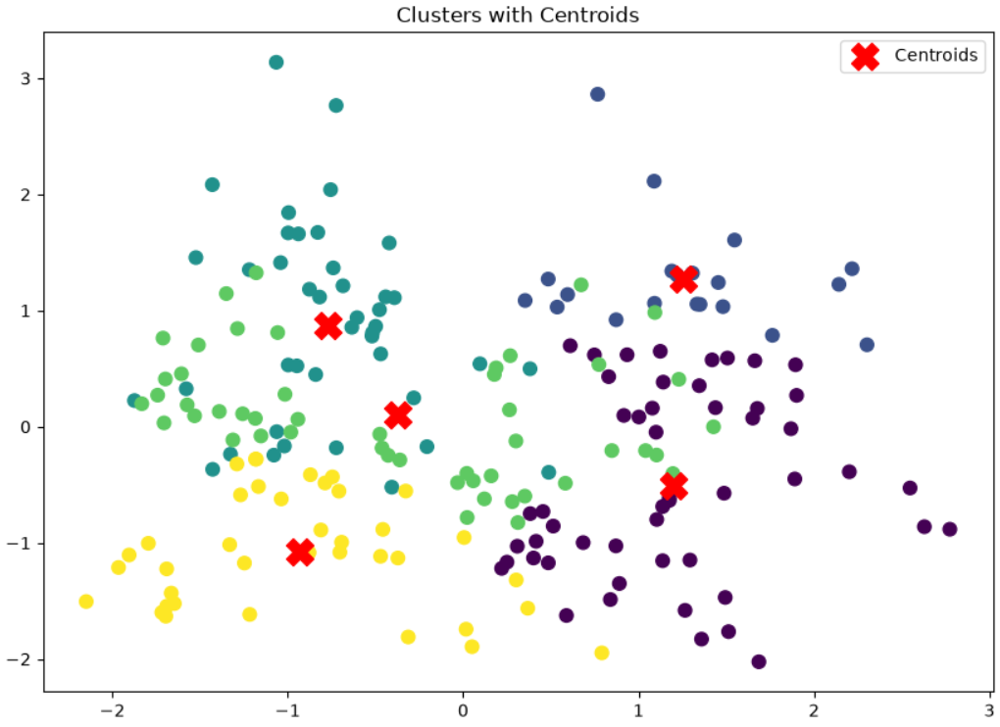

# 🛍️ Mall Customer Segmentation using K-Means Clustering

## 📌 Project Overview

Customer segmentation is a technique used by businesses to divide customers into different groups based on their characteristics and purchasing behavior.

This project focuses on analyzing mall customer data and creating meaningful customer segments using **Unsupervised Machine Learning (K-Means Clustering)**.

The objective is to identify customer groups based on their **income and spending patterns**, helping businesses understand customer behavior and design targeted marketing strategies.

---

# 🎯 Problem Statement

Retail businesses often have customers with different purchasing behaviors. Treating all customers equally can lead to ineffective marketing campaigns.

The goal of this project is to:

- Analyze customer characteristics
- Identify hidden customer groups
- Apply clustering techniques
- Generate business insights from customer segments

---

# 📂 Dataset Information

The dataset contains information about mall customers.

### Features:

| Feature | Description |
|---------|-------------|
| CustomerID | Unique customer identifier |
| Gender | Customer gender |
| Age | Customer age |
| Annual Income | Customer annual income |
| Spending Score | Score assigned based on customer spending behavior |

---

# 🛠️ Technologies Used

### Programming Language
- Python

### Libraries

- Pandas
- NumPy
- Matplotlib
- Seaborn
- Scikit-learn

### Machine Learning Techniques

- Data Preprocessing
- Exploratory Data Analysis (EDA)
- Feature Scaling
- Principal Component Analysis (PCA)
- K-Means Clustering
- Elbow Method

---

# 🔍 Project Workflow

## 1. Data Collection

Imported the mall customer dataset and performed initial data inspection.

---

## 2. Data Cleaning

Performed:

- Checking missing values
- Checking duplicate records
- Understanding data types
- Handling unnecessary columns

---

## 3. Exploratory Data Analysis (EDA)

Analyzed customer behavior using:

- Distribution plots
- Scatter plots
- Box plots
- Correlation analysis

Key patterns were identified between:

- Annual Income
- Spending Score
- Age

### Correlation Matrix



---

## 📈 Elbow Method

The Elbow Method was used to determine the optimal number of customer clusters.


---

## 🤖 K-Means Clustering Result

Customers were successfully grouped into different clusters based on Annual Income and Spending Score.




---

## 4. Feature Engineering

Selected important features for clustering:

- Annual Income
- Spending Score

Applied:

- StandardScaler for normalization
- PCA for dimensionality reduction and visualization

---

# 🤖 Machine Learning Model

## K-Means Clustering

K-Means is an unsupervised machine learning algorithm that groups similar data points into clusters.

### Steps:

1. Select number of clusters
2. Initialize cluster centroids
3. Assign data points to nearest centroid
4. Update centroid positions
5. Repeat until clusters stabilize

---

# 📊 Finding Optimal Clusters

## Elbow Method

The Elbow Method was used to determine the optimal number of clusters.

The method calculates Within-Cluster Sum of Squares (WCSS) for different values of K.

The point where the decrease in WCSS slows down represents the ideal number of clusters.

---

# 📈 Customer Segments Identified

Based on clustering results, customers were divided into different groups:

### Cluster 1: High Income - High Spending Customers

**Characteristics:**
- High purchasing power
- Premium customers
- Valuable for targeted offers

**Business Strategy:**
- Loyalty programs
- Premium product recommendations

---

### Cluster 2: High Income - Low Spending Customers

**Characteristics:**
- High earning customers
- Lower purchase frequency

**Business Strategy:**
- Personalized promotions
- Engagement campaigns

---

### Cluster 3: Low Income - High Spending Customers

**Characteristics:**
- Frequent shoppers
- Strong brand engagement

**Business Strategy:**
- Customer retention programs

---

### Cluster 4: Low Income - Low Spending Customers

**Characteristics:**
- Limited spending behavior

**Business Strategy:**
- Budget-friendly offers

---

# 📊 Project Visualizations

The project includes:

- Customer distribution analysis
- Correlation heatmap
- Income vs Spending Score analysis
- Elbow curve visualization
- Cluster visualization
- PCA-based cluster representation

---

# 💡 Business Insights

The analysis helps businesses to:

- Understand different customer groups
- Create personalized marketing campaigns
- Improve customer retention
- Identify premium customers
- Optimize business strategies

---

# 📚 Learning Outcomes

Through this project, I gained practical experience in:

- Python Programming
- Data Cleaning
- Exploratory Data Analysis
- Data Visualization
- Feature Engineering
- Data Scaling
- PCA
- Unsupervised Machine Learning
- K-Means Clustering
- Business Insight Generation

---

# 📁 Project Structure

```
Mall-Customer-Segmentation
│
├── Dataset
│   └── Mall_Customers.csv
│
├── Images
│   ├── Correlation_Matrix.png
│   ├── Cluster_Centroids.png
│   ├── Customer_segmentation.png
│
├── Mall_Customer_Segmentation.ipynb
│
├── README.md
│
└── requirements.txt
```

---

# 🚀 Future Improvements

Possible improvements:

- Try advanced clustering algorithms:
  - DBSCAN
  - Hierarchical Clustering

- Deploy the model using:
  - Streamlit
  - Flask

- Build an interactive customer segmentation dashboard using:
  - Power BI
  - Tableau

---

# 👨‍💻 Author

**Anuj Bhatt**


GitHub:
https://github.com/anujbhatt30

---

# ⭐ Support

If you found this project useful, consider giving it a ⭐ on GitHub.