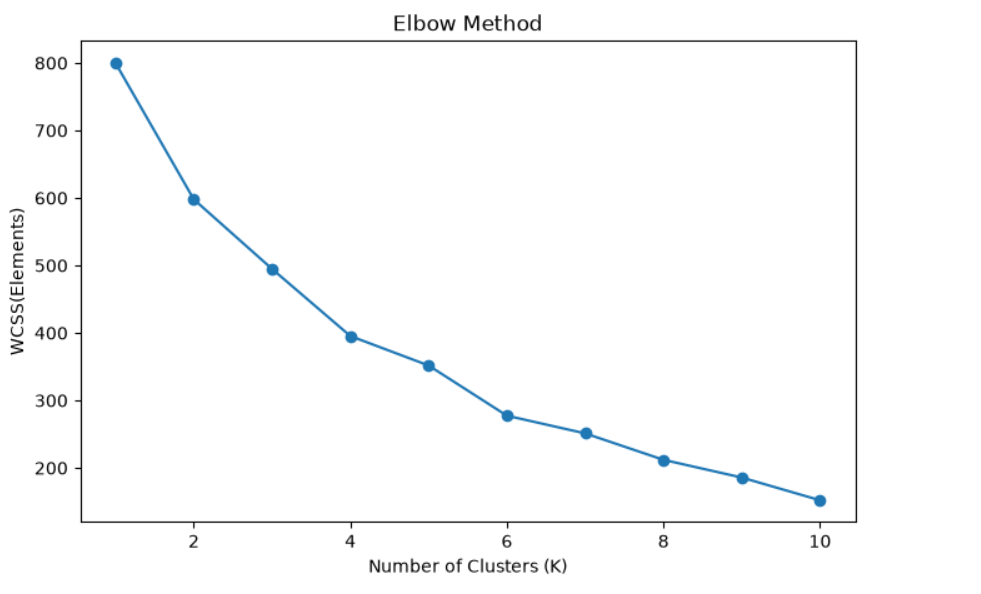

# 🛍️ Customer Segmentation using K-Means Clustering

A Machine Learning project that segments customers into different groups based on their purchasing behavior using the K-Means Clustering algorithm.

---

## 📌 Project Overview

Businesses can understand customer behavior better by grouping customers with similar characteristics. This project applies **K-Means Clustering** to identify customer segments using:

- Annual Income
- Spending Score

---

## 📂 Dataset

**Dataset:** Mall Customers Dataset

**Features**

- Customer ID
- Gender
- Age
- Annual Income (k$)
- Spending Score (1–100)

---

## 🛠️ Technologies Used

- Python
- Pandas
- NumPy
- Matplotlib
- Scikit-learn
- Jupyter Notebook

---

## 📈 Workflow

1. Import Dataset
2. Data Cleaning
3. Exploratory Data Analysis (EDA)
4. Feature Selection
5. Elbow Method
6. K-Means Clustering
7. Cluster Visualization
8. Business Insights

---

## 📊 Project Output

### Elbow Method



---

### Customer Clusters


---

## 📌 Business Insights

- High Income – High Spending customers are premium customers.
- High Income – Low Spending customers can be targeted using marketing campaigns.
- Low Income – High Spending customers are impulsive buyers.
- Low Income – Low Spending customers require budget-friendly offers.

---

## 🚀 Future Improvements

- Hierarchical Clustering
- DBSCAN
- Interactive Power BI Dashboard
- Streamlit Web App

---

## 📁 Project Structure

```
Mall-Customer-Segmentation/
│
├── Data/
├── Images/
├── notebook/
├── README.md
├── requirements.txt
└── .gitignore
```

---

## 👨‍💻 Author

**Anuj Bhatt**

GitHub: https://github.com/anujbhatt30
